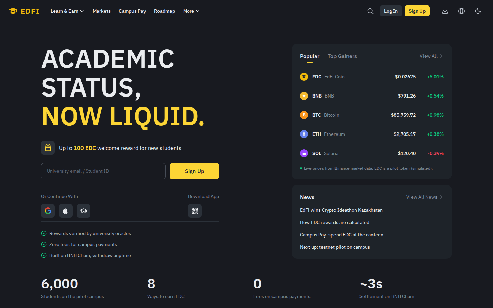
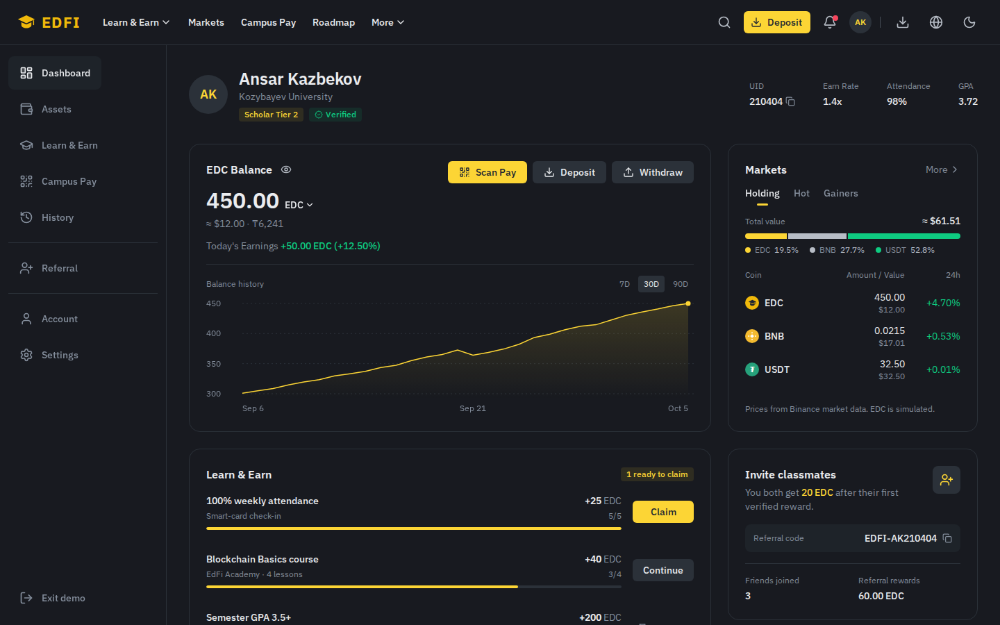
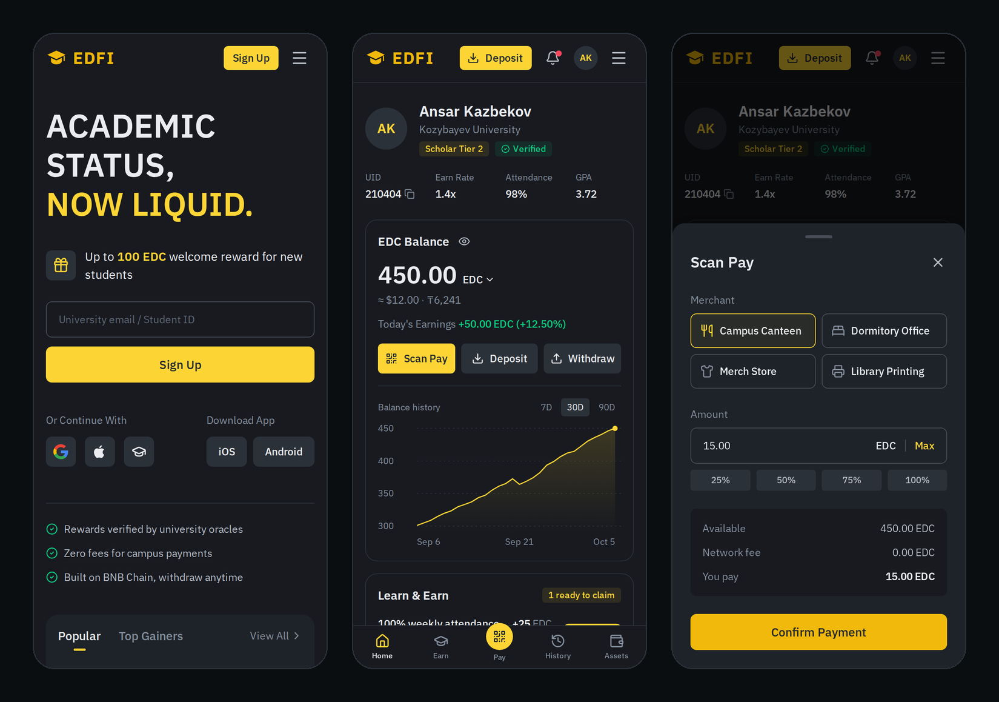
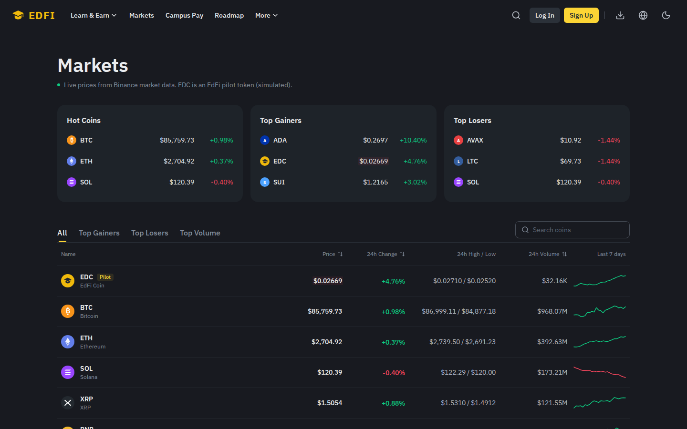
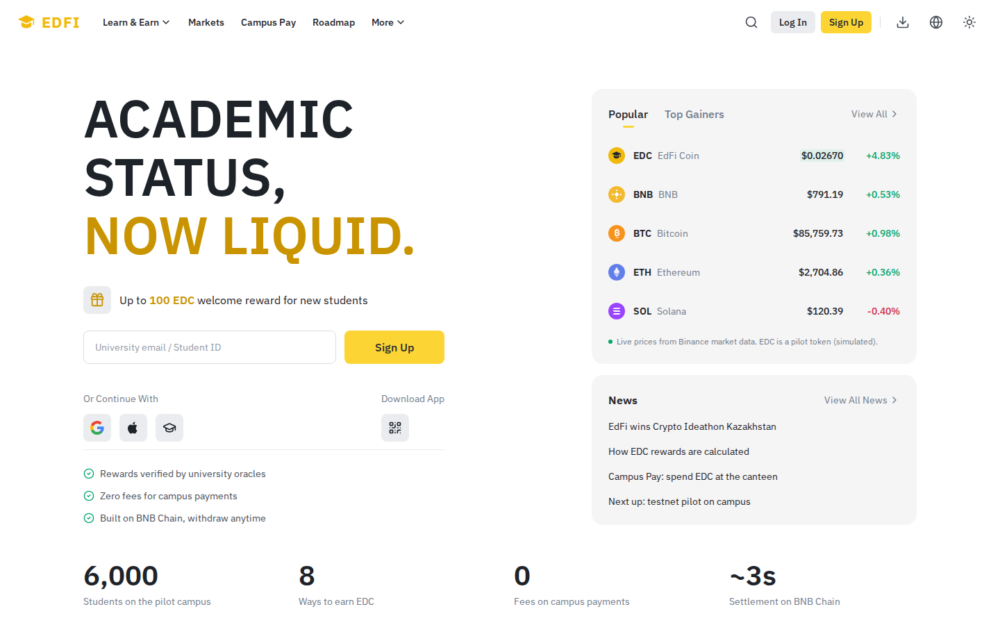

<div align="center">


# EdFi

**Academic status, now liquid.**<br>
A Learn-to-Earn platform for universities on BNB Chain.

🏆 **1st place · Crypto Ideathon Kazakhstan by Binance (2025)**

[**Live demo**](https://ed-fi.vercel.app) · [Wallet dashboard](https://ed-fi.vercel.app/demo) · [Markets](https://ed-fi.vercel.app/markets)

</div>



## The idea

Students put years of effort into results that end up as lines in a transcript. EdFi turns verified academic results into **EDC**, a BEP-20 token on BNB Chain that students can spend across campus or withdraw.

- **Earn.** Grades, attendance and published research are signed by university systems (LMS, registrar, smart-card check-in, DOI registry). An on-chain oracle verifies each result before any EDC is minted. No self-reported data.
- **Spend.** Scan to pay at the canteen, dormitory office or merch store, with zero fees and settlement in seconds.
- **Withdraw.** EDC moves to any BNB Chain wallet, where it can be swapped or staked.

The first campus is Kozybayev University in Petropavlovsk, Kazakhstan (6,000 students).

## What's in this repository

The web prototype: a marketing site and an interactive wallet dashboard.

| Route | What you can do |
|---|---|
| [`/`](https://ed-fi.vercel.app) | Landing page with live market card, reward rates, roadmap and FAQ |
| [`/demo`](https://ed-fi.vercel.app/demo) | Wallet dashboard: claim rewards, Scan Pay with receipt, deposit by QR, withdraw, balance history |
| [`/markets`](https://ed-fi.vercel.app/markets) | Market overview with sortable tables and live prices |

> [!NOTE]
> Balances, rewards and pilot figures in the demo are sample data, and EDC's price is simulated. Prices for BTC, ETH, BNB and other majors are live from Binance's public market-data API.

### Wallet dashboard



### Mobile



<details>
<summary><b>More screenshots</b>: markets page, light theme</summary>
<br>





</details>

## Features

- **Exchange-grade design system.** Dark and light themes built on design tokens, IBM Plex Sans with tabular figures, dense data layouts.
- **Live market data.** Prices from Binance's public API with flash-on-tick updates, automatic back-off and an offline snapshot fallback.
- **Complete wallet flows.** Claim rewards, Scan Pay (viewfinder, merchant, amount, receipt with transaction hash), deposit with a scannable QR code, withdraw with address validation, processing and completed states.
- **Account shell.** Two-step sign-up and log-in, notifications, account and settings panels, referral card.
- **Responsive.** From 390px phones to wide desktops, with a mobile drawer, bottom tab bar and bottom sheets.
- **Accessible.** Keyboard focus styles, focus trap and restore in dialogs, reduced-motion support.

## Tech stack

React 19 · Vite 7 · Tailwind CSS 3 · React Router 7 · lucide-react · qrcode-generator · IBM Plex Sans (self-hosted). Deployed on Vercel.

## Getting started

Requires Node.js 20.19+ or 22.12+.

```bash
npm install
npm run dev        # http://localhost:5173
npm run lint
npm run build      # production build in dist/
npm run preview    # serve the production build locally
```

## Project structure

```
src/
├── pages/              LandingPage, DashboardApp, MarketsPage
├── components/
│   ├── home/           Landing sections: Hero, EarnMarkets, Products, Roadmap, FAQ…
│   ├── dashboard/      Wallet widgets and dialogs: BalanceCard, TasksCard, PayModal…
│   └── …               Header, Footer, shared UI (CoinIcon, QRCode, Sparkline…)
├── data/content.js     Site copy: navigation, reward rates, roadmap, FAQ
├── state/              Live market data and sign-up dialog providers
├── lib/                Formatting, theme and link helpers
└── index.css           Design tokens (dark and light themes) and component classes
public/                 Favicon and social preview image
docs/screenshots/       Images used in this README
```

## Roadmap

1. ✅ **Concept & prototype** (2025): token mechanics and the web prototype. 1st place at Crypto Ideathon Kazakhstan by Binance.
2. ⏭️ **Testnet pilot**: smart contracts on BNB Smart Chain testnet and a sandbox pilot at Kozybayev University.
3. **Full campus economy**: mainnet launch and payments at canteens, dormitories and stores.
4. **National eGov integration** (2027): connect state education databases to scale across Kazakhstan.

## Author

**Ansar Kazbekov**: idea, product design and token mechanics.<br>
[LinkedIn](https://www.linkedin.com/in/ansar-kazbekov-50443439a) · Telegram [@nsrkz](https://t.me/nsrkz)

---

<sub>EdFi is an independent project. It is not affiliated with or endorsed by Binance.</sub>
